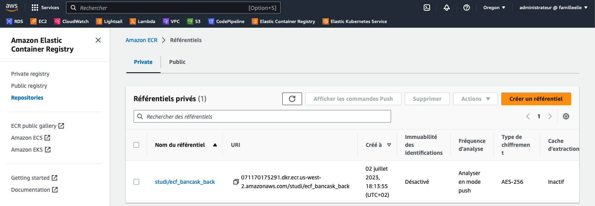
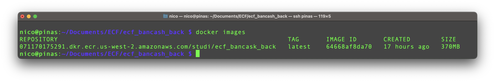
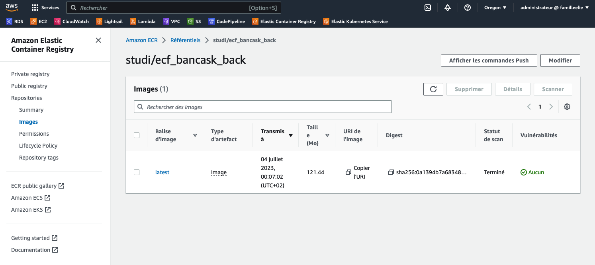

### Github repository : ecf_bancash_back.

# Activité Type 2 : Déploiement d’une application en continu

Included tasks :
1. Créez une application Nodejs (hello word) à partir d’une image docker Nodejs que vous exposerez sur un port (de votre choix).
2. Dockerizez votre application Nodejs.
3. Écrivez le script qui build/test et le nodejs ~~et déployez le sur le kube créé~~


## Introduction :
<p>This is a NestJs dockerized demo application published on AWS ECR via Terraform</p>

### What I done :

<p>
Hour priority is to store dockerized NestJS application in a container registry on the cloud. For that, I used the Terraform tool (main.ts file) in <b>only two steps :</b><br><br>
_ Step one : I described how to create a AWS Elastic Container Registry (ECR) to store our Docker image.<br><br>
_ Step two : Local execution of a local <b><u>shell script</b></u> who perfoms unit test in a image build phase (from a multi stage dockerfile).<br>

##Note##
If no errors occured while testing, the script will : build the production image, log Docker to AWS ECR server, push the image our ECR registry.<br><br></p>

## Off course, the script exits if the unit test faild.

<p><br>
Make sûr to have docker, terraform and aws cli command line tools installed and configured on your machine. Then, you can use the Terraform's main.tf file by :

Usage :
```
terraform init
terraform plan # For prevew what will do
terraform apply
```
</p>

# Screenshots

Step 1 : AWS console show the ecf_bancask_back registry just made :



We can list the image builded localy :



ecf_bancask_back registry detail. We can see the image inside :



## Credits
Inspired from : 
https://www.linkedin.com/pulse/how-upload-docker-images-aws-ecr-using-terraform-hendrix-roa/
and various Hashicorp documentation pages (https://developer.hashicorp.com/terraform/docs).